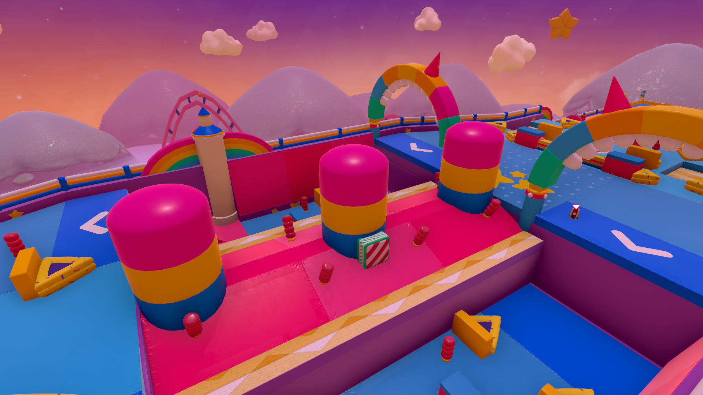
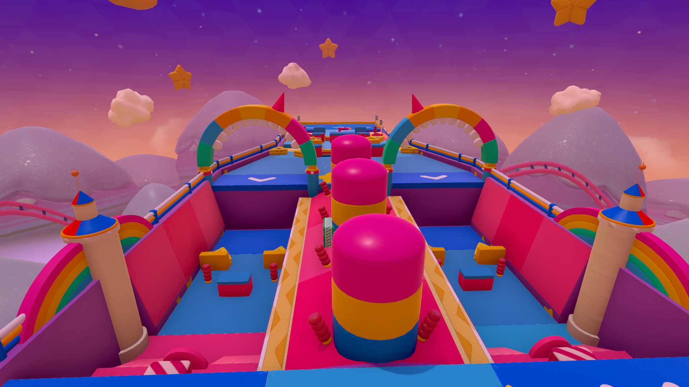

# Free Cam Mod

This utility allows you to use the free cam within Fall Guys in a vanilla way to take screenshots, etc

#### **Images**

### How to Use

By default, press F6 while in-game to toggle Free Cam. You can change this keybind in the BepInEx config, or by editing FallGuys\BepInEx\config\com.ElPanaHotDog.freecam.cfg

### How to install it?

- Install BepInEx IL2CPP by downloading it from:
   https://builds.bepinex.dev/projects/bepinex_be/785/BepInEx-Unity.IL2CPP-win-x64-6.0.0-be.785%2B6abdba4.zip
   Extract it into your Fall Guys installation folder.

- Edit FallGuys_client.ini so it contains the following values:

   TargetApplicationPath=FallGuys_client_game.exe
   
   WorkingDirectory=
   
   WaitForExit=0
   
   SkipEOS=0

- Extract the Free Cam mod ZIP and copy the included folder into FallGuys\BepInEx\plugins.
   Launch Fall Guys and wait for BepInEx to finish its initial setup.

   # CREDITS
   
   Creator: **ElPanaHotDog**
   
   BetaTesters: **CarritoDeCoto**, **Luger31**

   
